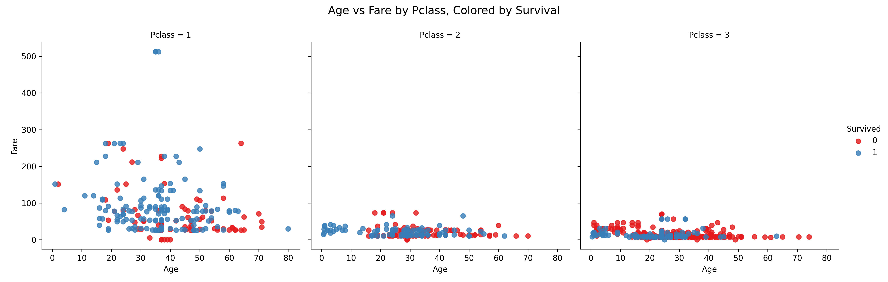
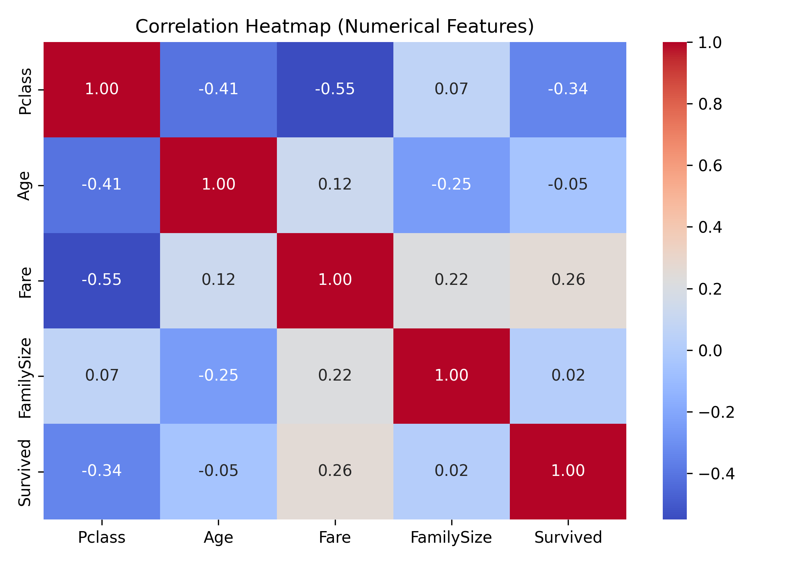
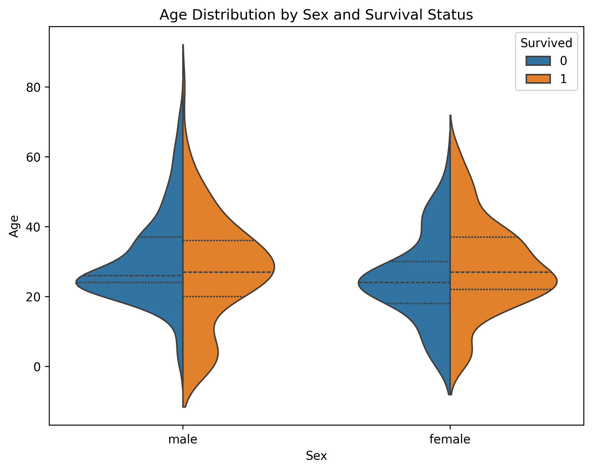

## Assumptions
1. Dataset: The file Book1.csv corresponds to the Titanic dataset provided in the assignment.
2. Column names: The dataset contains standard Titanic columns, including Pclass, Age, Fare, SibSp, Parch, Sex, Survived, Name, and Embarked.
3. Imputation choice: When imputing missing ages, the median per Pclass is assumed to be more robust than the mean, given the skewed distribution of ages.
4. Outliers: Outliers in Fare are identified but not removed, under the assumption that extreme fares represent real passengers and carry meaningful information.
5. Context: Some insights may be supported with general knowledge about Titanic evacuation protocols (e.g., “women and children first”) to strengthen interpretation.

## 1) Non-obvious insights :
1. Women and children first
The violin plot shows that the largest number of survivors were in the 20–40 age group, especially among both men and women. This indicates that young adults had the highest survival counts. However, when comparing children (under 20) with older adults (above 40), it is clear that children had a higher survival rate than older adults, for both genders. This aligns with the “women and children first” policy, where children were prioritized for lifeboats over older passengers. For women, survival rates were higher across almost all ages compared to men, but the difference is most noticeable for younger women, again consistent with evacuation priorities during the disaster.

2. Pclass and Fare Do Not Always Align in Predicting Survival
From the scatter plot of Age vs. Fare by Pclass (colored by survival), survival rates were higher among first-class passengers who paid higher fares. However, in third class, even passengers who paid relatively higher fares (e.g., large families) still had low survival chances. This indicates that social class mattered more than absolute ticket price. In other words, even if someone in third class paid more due to traveling with family, they were not prioritized in evacuation.

3. Gender and Class Interact in Survival Outcomes
From the violin plot and the heatmap, women generally had higher survival rates, but this effect was much stronger in first and second class compared to third class. This means gender protection was not applied equally across classes. Women in first class were strongly prioritized, while women in third class still faced high risk. This suggests a hierarchical prioritization: women and children in higher classes first, followed by those in lower classes.

## 2) Why log-transform Fare helps gradient-based optimization
- The fare feature is highly skewed (with some extreme outliers). In gradient descent–based optimization, these extreme values make gradients unstable:
  1. The model can become overly focused on a few extreme examples.
  2. The loss function landscape becomes “tilted,” making it harder to find the optimal path.
  3. Training can become slower or fail to converge.
  By applying a logarithmic transformation (log(Fare)), the distribution becomes more symmetric. This has several benefits:
  1. The scale of variation across samples is more balanced.
  2. Gradients are more stable, and step sizes are more consistent.
  3. Training converges faster and more reliably.

## 3) Correlation vs causation (Pclass vs Survived)
- The negative correlation between pclass and survived does not prove causation. Correlation only shows association, not cause-and-effect. Other confounding variables influence both.
Examples of confounders:
 - Fare (ticket price) → First-class passengers paid higher fares and also had better access to lifeboats. Thus, survival is more directly linked to wealth and access than to the numeric class itself.
 - Cabin location → First-class passengers were located closer to the deck and lifeboats, while third-class passengers were in the lower decks. Proximity, not class per se, was critical in evacuation.
In short, pclass is correlated with survival, but the relationship is mediated by other factors such as wealth, cabin location, and evacuation priority.

## Files produced:
1. [Titanic cleaned and engineered DataFrame](titanic_cleaned_engineered.csv)
2. [Matrix](matrix.csv)
3. [Standarazied Data](standarazied_data.csv)
4. 
5. 
6. 

